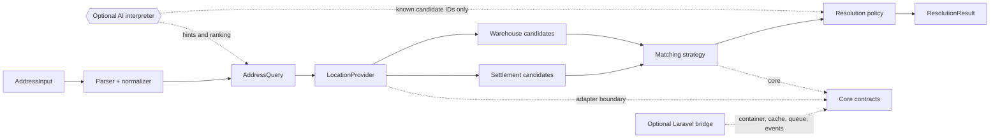

# Architecture

[Documentation index](README.md) · [Українська](uk/ARCHITECTURE.md)

The resolver keeps domain decisions in a framework-free core. Provider and AI
adapters sit at the boundary, and the optional Laravel package only wires
those contracts into a host application.

The data flow has four safety invariants:

1. `LocationProvider` is the source of truth for settlement and warehouse
   records.
2. AI may parse hints or rank supplied candidates, but it cannot introduce a
   provider reference.
3. The policy returns `ambiguous` when evidence is insufficient; the host
   application owns the final human choice and persistence.
4. Provider failures remain `provider_error` and are not converted into
   `not_found`.

The root package contains only PHP domain code. The OpenAI adapter accepts PSR
HTTP dependencies, the Laravel bridge depends on the core package, and a host
application can implement `LocationProvider` for its own SDK, HTTP client, or
read model. Tests and terminal examples use synthetic fixtures and never call
an external service.
