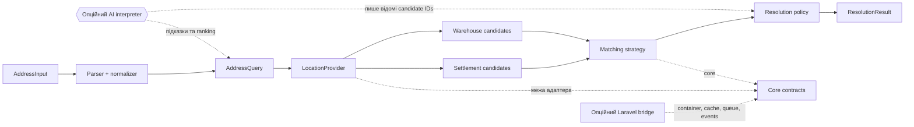

# Архітектура

[Індекс документації](../README.uk.md) · [English](../ARCHITECTURE.md)

Resolver зберігає доменні рішення у framework-free core. Provider- та AI-
адаптери знаходяться на межі системи, а опційний Laravel package лише підключає
ці контракти до host-застосунку.

У потоці даних діють чотири гарантії:

1. `LocationProvider` є джерелом істини для записів населених пунктів і
   відділень.
2. AI може розібрати підказки або ранжувати переданих кандидатів, але не може
   додати reference, якого немає у provider-даних.
3. Policy повертає `ambiguous`, коли доказів недостатньо; остаточний вибір і
   persistence належать host-застосунку.
4. Помилки provider-а залишаються `provider_error` і не перетворюються на
   `not_found`.

Root package містить лише PHP domain code. OpenAI adapter приймає PSR HTTP
dependencies, Laravel bridge залежить від core, а host-застосунок може
реалізувати `LocationProvider` для власного SDK, HTTP-клієнта або read model.
Тести й terminal examples використовують синтетичні fixtures і не звертаються
до зовнішніх сервісів.
